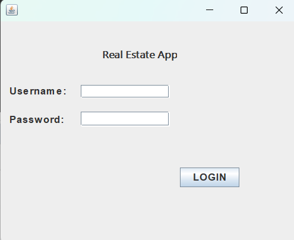
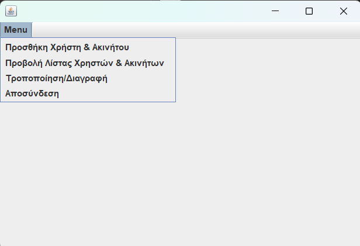
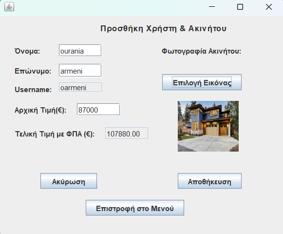
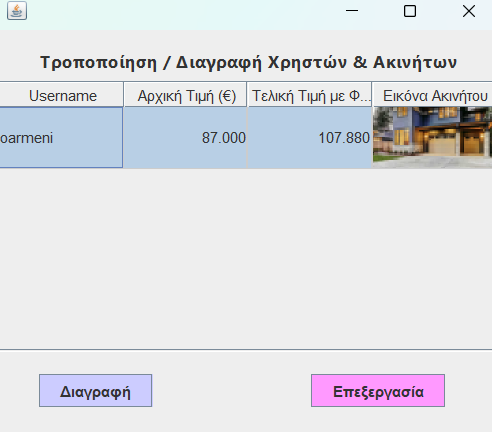
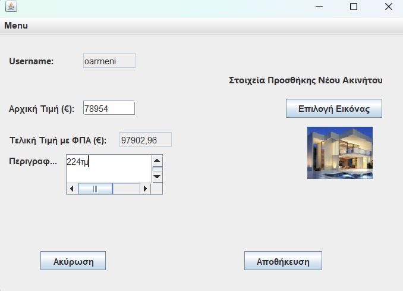
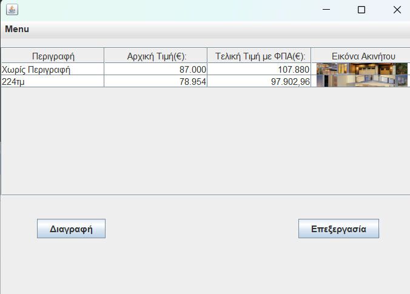
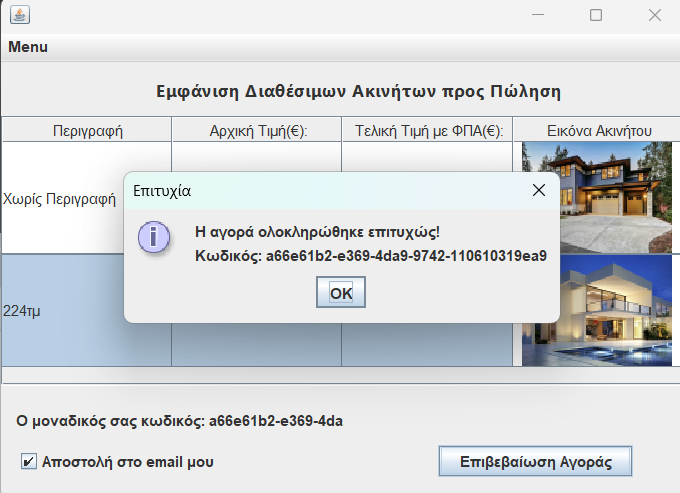

# Real Estate App

## 📌 Project Overview
The **Real Estate App** is a Java-based desktop application developed in **Apache NetBeans**. It allows users to manage real estate properties, including adding, viewing, modifying, and deleting property listings. The application features a user authentication system and supports property image uploads.

## 🚀 Features
- **User Authentication**: Secure login system.
- **Property Management**:
  - Add new properties with price, VAT, and images.
  - View all listed properties in a structured table.
  - Modify or delete existing properties.
- **Purchase System**:
  - Users can finalize property purchases.
  - Unique purchase codes are generated upon successful transactions.
  - Option to send purchase details via email.

## 🛠️ Technologies Used
- **Java** (Swing for UI)
- **Apache NetBeans** (Development Environment)
- **MySQL** (Database for storing user and property data)

## 📷 Screenshots

### 1. Login Screen

### 2. Main Menu

### 3. Add Property

### 4. View Properties

### 5. Modify/Delete Properties

### 6. Add New Property Details

### 7. List of Properties

### 8. Purchase Confirmation

## 🛠 Future Enhancements
- Improve UI/UX with better design and responsiveness.
- Integrate an email notification system for purchases.

